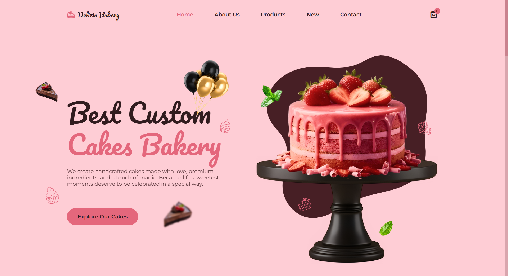
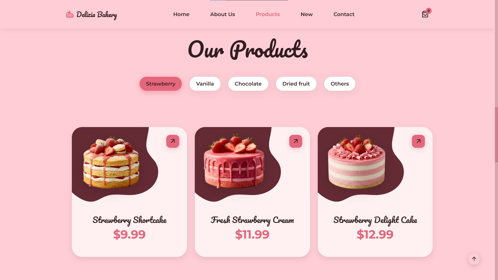
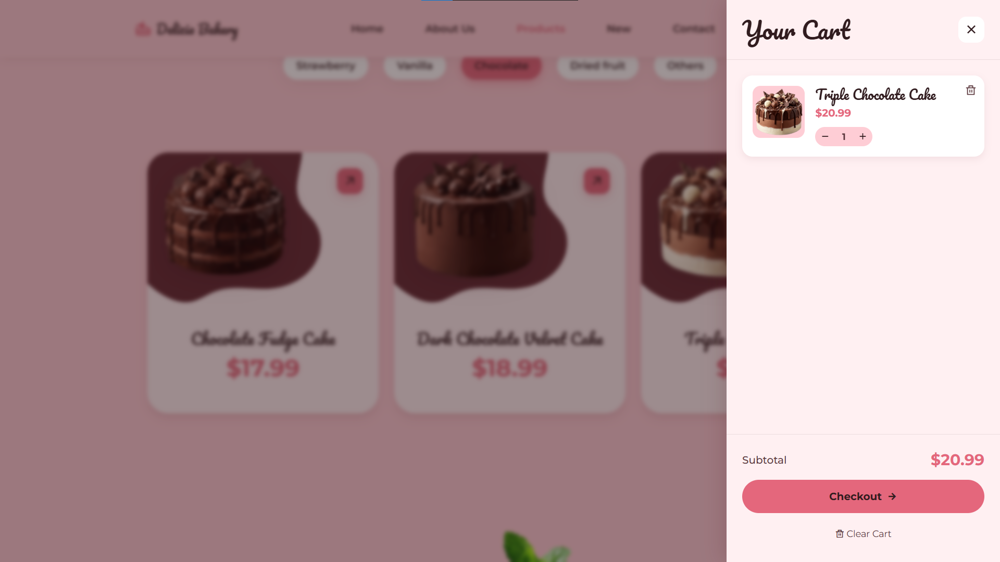
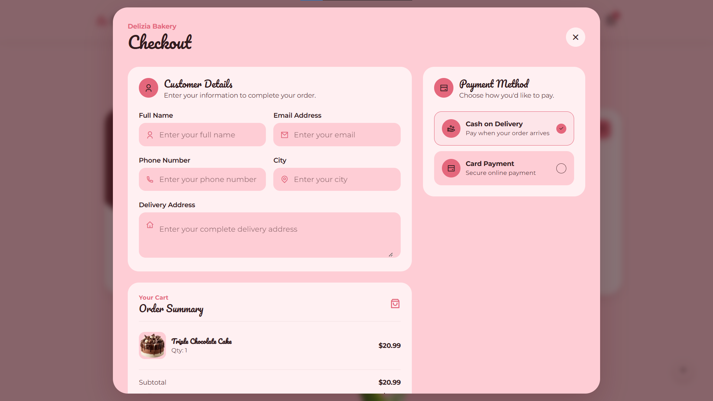
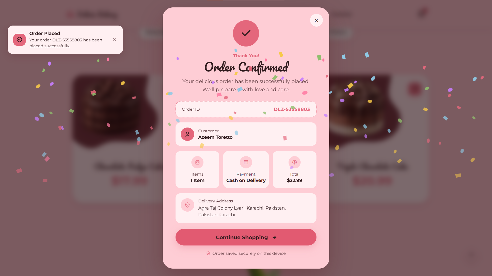

<div align="center">


</div>

<div align="center"><h1>🍰 Delizia Bakery</h1></div>

### A Modern & Responsive Bakery Website

Delizia Bakery is a modern, elegant, and fully responsive bakery website created by **Wolvo Digital** to deliver a smooth and delightful online cake-shopping experience.

The website combines a beautiful bakery-focused interface with categorized products, interactive cart functionality, checkout flow, payment selection, order confirmation, and responsive layouts across different screen sizes.

🔗 **Live Demo:**
https://delizia-bakery.netlify.app/

---

## ✨ Features

* 🎂 Modern and elegant bakery UI
* 📱 Fully responsive design
* 🧁 Organized product categories
* 🍓 Strawberry, Vanilla, Chocolate & other cake collections
* 🛒 Interactive shopping cart
* ➕ Add products to cart
* 🗑️ Remove products from cart
* 💰 Automatic subtotal calculation
* 🚚 Delivery fee calculation
* 🛍️ Complete checkout experience
* 👤 Customer information form
* 💳 Cash on Delivery & Card Payment options
* ✅ Order confirmation screen
* 🆔 Automatic order ID generation
* 💾 Local order information storage
* 🎨 Smooth animations and interactive elements
* 📍 Contact and bakery information section
* 📱 Mobile-friendly navigation
* ⚡ Fast and lightweight frontend

---

## 🖥️ Screenshots

### 🏠 Home



### 🍰 Products



### 🛒 Shopping Cart



### 💳 Checkout



### ✅ Order Confirmation



> 📸 All screenshots are available inside the `Screenshots` folder.

---

## 🛠️ Technologies Used

* **HTML5** — Website structure
* **CSS3** — Styling, responsive layouts & animations
* **JavaScript** — Interactivity and functionality
* **Git & GitHub** — Version control
* **Netlify** — Deployment

---

## 🧁 Product Categories

Delizia Bakery provides multiple product categories to make browsing simple and convenient:

* 🍓 Strawberry
* 🍦 Vanilla
* 🍫 Chocolate
* 🌰 Dried Fruit
* 🍰 Other Desserts

The website features a variety of cakes, brownies, cupcakes, and other sweet creations.

---

## 🛒 Shopping & Checkout

Delizia Bakery provides a complete frontend shopping experience.

Users can:

1. Browse available cakes and desserts
2. Select their favorite products
3. Add products to the shopping cart
4. Review cart items and pricing
5. Proceed to checkout
6. Enter customer and delivery details
7. Select a payment method
8. Place the order
9. View their order confirmation

The checkout interface includes customer information, delivery details, payment selection, order summary, delivery charges, and final order confirmation.

---

## 📂 Project Structure

```text
Delizia-Bakery/
│
├── assets/
│   ├── css/
│   ├── js/
│   └── img/
│
├── Screenshots/
│   ├── hero.png
│   ├── products.png
│   ├── cart.png
│   ├── checkout.png
│   └── order-confirmation.png
│
├── index.html
└── README.md
```

---

## 🎯 Project Goals

The goal of Delizia Bakery was to create a visually appealing and user-friendly bakery website that brings together:

* Modern UI/UX design
* Responsive web development
* Product discovery
* Shopping cart functionality
* Checkout experience
* Interactive user interfaces
* Smooth and intuitive navigation

The project was developed with a focus on delivering a polished digital experience using lightweight and efficient web technologies.

---

## 🚀 Live Demo

### 🍰 Visit Delizia Bakery

👉 **https://delizia-bakery.netlify.app/**

---

## 🏢 Developed by Wolvo Digital

**Wolvo Digital** is a technology-driven company focused on building modern, scalable, and high-performance digital solutions for businesses.

> **Turning ideas into powerful digital experiences with innovative technology and creative solutions.**

### What We Build

* 🌐 Modern Websites
* 📱 Mobile Applications
* 💻 Business Software
* 🎨 UI/UX Experiences
* ⚙️ Custom Digital Solutions
* 🚀 Scalable Technology Products

---

## ⭐ Support

If you like this project, consider giving it a ⭐ on GitHub.

Your support helps **Wolvo Digital** continue building innovative digital experiences and technology solutions.

---

### 🍰 Delizia Bakery

**Fresh. Beautiful. Delicious.**

Built with ❤️ by **Wolvo Digital**
